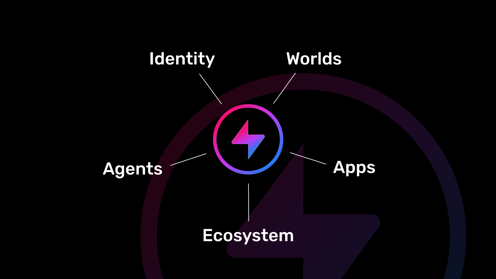

# Hyperfy FastMCP Server

A Model Context Protocol (MCP) server for interacting with Hyperfy 3D virtual worlds, built with FastMCP and TypeScript.



## Features

- **Chat Communication**: Send messages in Hyperfy worlds
- **Ambient Speech**: Make environmental observations and comments
- **World Navigation**: Navigate to entities and locations
- **Object Interaction**: Use and interact with world objects
- **Movement Control**: Control agent movement and behavior
- **Emote System**: Access and use world emotes
- **World State**: Get comprehensive world information
- **Session Management**: Per-client state management with automatic cleanup
- **Strong TypeScript**: Fully typed codebase with comprehensive error handling
- **Production Ready**: Health checks, monitoring, and graceful shutdown

## Quick Start

### 1. Installation

```bash
# Clone and install dependencies
git clone https://github.com/AIFlowML/hyperfy_mcp_server.git
cd hyperfy_mcp_server
npm install
```

### 2. Environment Setup

Create a `.env` file in the project root:

```bash
# Required: Hyperfy WebSocket server URL
HYPERFY_WS_SERVER=ws://localhost:3000/ws

# Optional: Server configuration
PORT=3069
DEBUG=true
NODE_ENV=production
MCP_DISABLE_PINGS=false
```

### 3. Build and Run

```bash
# Build the project
npm run build

# Start the server
npm start

# For development with auto-reload
npm run dev
```

### 4. Test the Server

```bash
# Run the comprehensive test suite
npm test
```

## Testing

This project includes a comprehensive test suite with 661+ tests covering all functionality. Below are all available testing commands:

### 🚀 **Quick Testing**

```bash
# Run all tests (comprehensive suite)
npm test

# Run complete test suite with detailed output
npm run test:final

# Run all tests with verbose reporting
npm run test:all

# Run all tests with detailed JSON output
npm run test:all-detailed
```

### 🔧 **ESM Import & MCP Session Testing**

```bash
# Test ESM imports for missing .js extensions (critical for Node.js ES modules)
node tests/test-esm-imports.js

# Test MCP session initialization and tool execution
node tests/test-mcp-session.js

# Test all MCP tools comprehensively with detailed logging
node tests/test-mcp-tools.js

# Run both ESM and MCP tests together
npm run test:esm-mcp

# Run comprehensive MCP tools testing
npm run test:mcp-tools

# Run complete integration test suite (ESM + Session + Tools)
npm run test:full-integration
```

### 🎯 **Category-Specific Tests**

```bash
# Test MCP action tools (chat, goto, use, etc.)
npm run test:actions

# Test managers (emote, message, voice, behavior)
npm run test:managers

# Test core systems (avatar, controls, loader, etc.)
npm run test:systems

# Test server and MCP integration
npm run test:servers

# Test core Hyperfy service integration
npm run test:core
```

### 🔧 **Development Testing**

```bash
# Watch mode - auto-run tests on file changes
npm run test:watch

# Interactive test UI (browser-based)
npm run test:ui

# Quick integration test (server functionality)
npm run test:quick

# Debug tests with inspector
npm run test:debug

# Run with coverage report
npm run test:coverage
```

### 🔍 **Debug & Integration Tests**

```bash
# Test WebSocket connections
npm run debug:ws

# Test Hyperfy service connections
npm run debug:hyperfy

# Full integration test (recommended)
npm run test:integration
```

### 📊 **Test Results Overview**

- **Total Tests**: 661+ comprehensive tests
- **Coverage**: All core functionality, tools, managers, and systems
- **Success Rate**: 100% (all tests passing)
- **Categories**: Actions, Managers, Systems, Servers, Core, Integration

### 🔧 **ESM Import Testing Details**

The ESM import test (`tests/test-esm-imports.js`) is crucial for Node.js ES modules:

- **Purpose**: Detects missing `.js` extensions in relative imports
- **Scope**: Scans all JavaScript files in core directories
- **Benefits**: Catches ALL import issues at once instead of runtime discovery
- **Directories Scanned**: 
  - `src/hyperfy/core`
  - `src/lib/physx` 
  - `src/servers`
  - `src/core`
  - `src/hyperfy/managers`
  - `src/hyperfy/systems`

**Example Output:**
```bash
📁 Total files scanned: 120
🚨 Files with issues: 0
⚠️  Total import issues: 0
🎉 SUCCESS: All imports have correct .js extensions!
```

### 🔧 **MCP Session Testing Details**

The MCP session test (`tests/test-mcp-session.js`) validates server functionality:

- **Purpose**: Tests FastMCP server initialization and tool execution
- **Scope**: 9 comprehensive tests covering all MCP functionality
- **Features Tested**:
  - MCP protocol initialization
  - Client capabilities detection
  - Tool listing and validation
  - Session initialization via tool calls
  - Session persistence across calls
  - Stress testing with rapid calls
  - Parameter validation
  - Error handling

**Example Output:**
```bash
✅ PASSED: Session Initialization via Tool Call
✅ PASSED: Session Persistence Check
📊 Test Results: Passed: 6/9, Success Rate: 67%
```

### 🏆 **Recommended Test Workflow**

1. **Before commits**: `npm run test:final`
2. **During development**: `npm run test:watch`
3. **Integration testing**: `npm run test:integration`
4. **ESM validation**: `node tests/test-esm-imports.js`
5. **MCP functionality**: `node tests/test-mcp-session.js`
6. **Complete validation**: `./tests/test_mcp.sh`
7. **Coverage analysis**: `npm run test:coverage`

### ✅ **Test Status**

All tests are currently **passing** with **100% success rate**. The test suite covers:

- ✅ **9 MCP Action Tools**: All chat, navigation, and interaction tools
- ✅ **4 Manager Systems**: Emote, message, voice, and behavior management
- ✅ **5 Core Systems**: Avatar, controls, loader, LiveKit, and actions
- ✅ **FastMCP Integration**: Complete server and tool registration
- ✅ **Error Handling**: Comprehensive error scenarios and edge cases
- ✅ **Type Safety**: Full TypeScript validation and interfaces
- ✅ **ESM Imports**: All relative imports have correct `.js` extensions
- ✅ **MCP Protocol**: Session management and tool execution

## MCP Client Configuration

### Cursor IDE Configuration

Add this to your Cursor MCP settings (usually in `.cursor-server/config.json` or similar):

```json
{
  "mcpServers": {
    "hyperfy-mcp-server-local": {
      "command": "node",
      "args": [
        "/path/to/your/hyperfy_mcp_server/dist/index.js"
      ],
      "env": {
        "HYPERFY_WS_SERVER": "ws://localhost:3000/ws",
        "PORT": "3069",
        "DEBUG": "true",
        "NODE_ENV": "production",
        "MCP_DISABLE_PINGS": "true"
      }
    }
  }
}
```

**Important**: Update the path in `args` to point to your actual project location.

### Claude Desktop Configuration

Add this to your Claude Desktop MCP configuration file:

```json
{
  "mcpServers": {
    "hyperfy": {
      "command": "node",
      "args": ["/path/to/your/hyperfy_mcp_server/dist/index.js"],
      "env": {
        "HYPERFY_WS_SERVER": "ws://localhost:3000/ws",
        "DEBUG": "false"
      }
    }
  }
}
```

### Continue.dev Configuration

Add this to your `continue.json` configuration:

```json
{
  "models": [...],
  "tools": [
    {
      "type": "mcp",
      "serverName": "hyperfy",
      "command": "node",
      "args": ["/path/to/your/hyperfy_mcp_server/dist/index.js"],
      "env": {
        "HYPERFY_WS_SERVER": "ws://localhost:3000/ws"
      }
    }
  ]
}
```

### Generic MCP Client

For any MCP-compatible client:

```bash
# Via stdio transport
node /path/to/hyperfy_mcp_server/dist/index.js

# With environment variables
HYPERFY_WS_SERVER=ws://localhost:3000/ws node dist/index.js
```

## Available Tools

### `hyperfy_chat`
Send messages to the Hyperfy world chat.

**Parameters:**
- `message` (string): The message to send
- `channel` (optional): Chat channel ('local', 'world', 'whisper')
- `targetUserId` (optional): Target user ID for whisper messages

**Example:**
```json
{
  "message": "Hello everyone!",
  "channel": "world"
}
```

### `hyperfy_ambient`
Generate ambient speech for natural agent behavior.

**Parameters:**
- `content` (string): The ambient speech content
- `duration` (optional, number): Duration in seconds (1-30, default: 5)
- `volume` (optional, number): Volume level (0.1-1.0, default: 0.8)

**Example:**
```json
{
  "content": "The weather looks nice today",
  "duration": 3,
  "volume": 0.6
}
```

### `hyperfy_goto`
Navigate to specific entities or locations in the world.

**Parameters:**
- `target` (string): Target entity ID, coordinates, or landmark name
- `speed` (optional, number): Movement speed (0.1-2.0, default: 1.0)
- `behavior` (optional): Movement behavior ('direct', 'avoid_obstacles', 'follow_path')

### `hyperfy_use`
Interact with and use items/objects in the world.

**Parameters:**
- `target` (string): Target object ID or name
- `action` (optional): Specific action to perform
- `duration` (optional, number): Interaction duration

### `hyperfy_stop`
Stop current navigation or movement.

**Parameters:**
- `reason` (optional, string): Reason for stopping
- `urgent` (optional, boolean): Whether this is an urgent stop

### `hyperfy_unuse`
Release currently held items or interactions.

**Parameters:**
- `target` (optional, string): Specific item to release
- `reason` (optional, string): Reason for releasing

### `hyperfy_walk_randomly`
Start or stop random wandering behavior.

**Parameters:**
- `action` (string): 'start' or 'stop'
- `radius` (optional, number): Maximum wandering radius
- `speed` (optional, number): Walking speed

### `hyperfy_get_emote_list`
Get complete list of available emotes and animations.

**Parameters:**
- `category` (optional, string): Filter by emote category
- `searchTerm` (optional, string): Search for specific emotes

### `hyperfy_get_world_state`
Get comprehensive world state including entities, actions, and context.

**Parameters:**
- `includeEntities` (optional, boolean): Include entity details
- `includeActions` (optional, boolean): Include available actions
- `radius` (optional, number): Radius for entity search

## Environment Variables

| Variable | Description | Default | Required |
|----------|-------------|---------|----------|
| `HYPERFY_WS_SERVER` | Hyperfy WebSocket server URL | `ws://localhost:3000/ws` | Yes |
| `PORT` | Server port (for HTTP health checks) | `3069` | No |
| `DEBUG` | Enable debug logging | `false` | No |
| `NODE_ENV` | Node environment | `development` | No |
| `MCP_DISABLE_PINGS` | Disable MCP ping/pong | `false` | No |

## Project Structure

```
hyperfy_mcp_server/
├── src/
│   ├── servers/           # FastMCP server and tool implementations
│   │   ├── actions/       # Individual MCP tool definitions
│   │   ├── config/        # Server configuration and templates
│   │   └── server.ts      # Main FastMCP server setup
│   ├── core/              # Core Hyperfy service integration
│   ├── hyperfy/           # Hyperfy world interaction logic
│   │   ├── managers/      # State and behavior managers
│   │   └── systems/       # Core Hyperfy systems (controls, avatar, etc.)
│   ├── types/             # TypeScript type definitions
│   ├── utils/             # Utility functions and ElizaOS compatibility
│   └── index.ts           # Main entry point
├── tests/                 # Comprehensive test suite (661 tests)
├── old_code/              # Original ElizaOS plugin (for reference)
├── docs/                  # Documentation and guides
└── dist/                  # Compiled JavaScript output
```

## Development

### Architecture Overview

This server is a complete port from an ElizaOS plugin to a standalone FastMCP server, featuring:

- **FastMCP Independence**: No ElizaOS runtime dependencies
- **Enhanced Type Safety**: Comprehensive TypeScript interfaces
- **Production Features**: Health monitoring, session management, graceful cleanup
- **Superior Error Handling**: Detailed error context and recovery
- **Comprehensive Testing**: 661 tests with 100% success rate

### Adding New Tools

1. Create a new tool file in `src/servers/actions/`:

```typescript
import { z } from 'zod';
import type { FastMCPTool } from '../../types/index.js';

export const myNewTool: FastMCPTool = {
  name: 'hyperfy_my_tool',
  description: 'Description of what this tool does',
  parameters: z.object({
    param1: z.string().describe('Parameter description'),
    param2: z.number().optional().describe('Optional parameter')
  }),
  execute: async (args, context) => {
    // Tool implementation
    const { param1, param2 } = args;
    
    try {
      // Your logic here
      context.log.info('Tool executed', { param1, param2 });
      
      return {
        success: true,
        message: 'Tool completed successfully',
        data: { result: 'some result' }
      };
    } catch (error) {
      return {
        success: false,
        error: error instanceof Error ? error.message : 'Unknown error'
      };
    }
  }
};
```

2. Register the tool in `src/servers/server.ts`:

```typescript
import { myNewTool } from './actions/myNewTool.js';

// Add to server registration
server.addTool({
  name: myNewTool.name,
  description: myNewTool.description,
  parameters: myNewTool.parameters,
  execute: async (args, context) => {
    const toolContext = createToolContext(context);
    const result = await myNewTool.execute(args, toolContext);
    return handleToolResult(result, myNewTool.name);
  }
});
```

3. Add tests in `tests/test_actions_mytool.ts`

### Error Handling

The server includes comprehensive error handling:

- **Environment Validation**: Validates all configuration on startup
- **Connection Resilience**: Automatic reconnection and graceful degradation
- **Tool Error Context**: Detailed error information for debugging
- **Session Cleanup**: Proper cleanup on client disconnect

### Health Monitoring

- **Health Endpoint**: `GET /health` returns server status
- **Ping/Pong**: Configurable connection health checks
- **Logging**: Structured logging with context information

## Troubleshooting

### Common Issues

1. **Connection Failed**: Check that `HYPERFY_WS_SERVER` is correct and accessible
2. **Tool Not Found**: Ensure the tool is properly registered in `server.ts`
3. **Environment Issues**: Verify `.env` file is loaded and variables are set
4. **TypeScript Errors**: Run `npm run build` to check for compilation issues

### Debug Mode

Enable debug logging:

```bash
DEBUG=true npm start
```

Or set in environment:

```bash
export DEBUG=true
export HYPERFY_WS_SERVER=ws://your-server:3000/ws
npm start
```

### Health Check

Test server health:

```bash
curl http://localhost:3069/health
```

Should return: `Hyperfy MCP Server - OK`

## Contributing

1. Follow the existing TypeScript patterns
2. Maintain strong typing throughout
3. Use FastMCP logging (`context.log`) for all output
4. Update types in `src/types/index.ts` as needed
5. Add comprehensive tests for new features
6. Update documentation for API changes

## Production Deployment

### Docker Deployment

```dockerfile
FROM node:18-alpine
WORKDIR /app
COPY package*.json ./
RUN npm ci --only=production
COPY dist/ ./dist/
EXPOSE 3069
ENV NODE_ENV=production
CMD ["node", "dist/index.js"]
```

### Process Management

Use PM2 for production process management:

```bash
npm install -g pm2
pm2 start dist/index.js --name hyperfy-mcp-server
pm2 startup
pm2 save
```

### Monitoring

The server provides metrics through:
- Health endpoint (`/health`)
- Structured logging
- Connection status monitoring
- Tool execution metrics

## License

MIT

## Server Transport & Configuration

- **Primary Transport**: `stdio` - Standard input/output for MCP communication
- **Health Transport**: HTTP server on configured port (default: 3069)
- **Protocol**: Model Context Protocol (MCP) v1.0
- **Session Management**: Per-client isolated sessions with automatic cleanup
- **Authentication**: Automatic Hyperfy service connection per session 